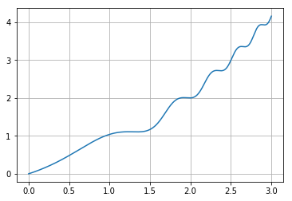
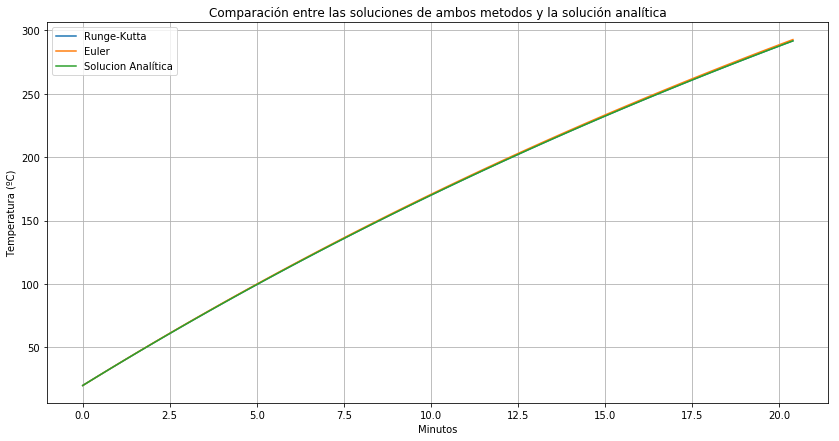
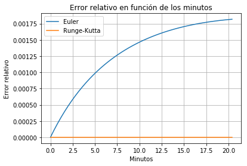
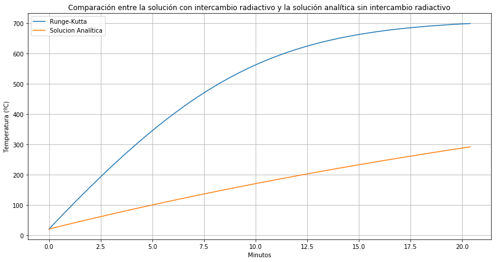
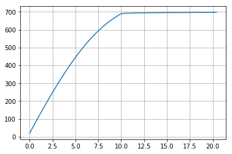
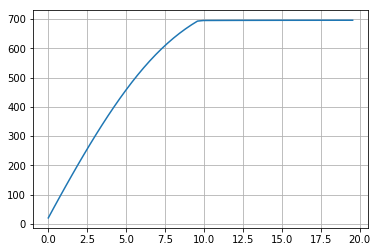

Introducción
------------------

Se plantea resolver la evolución temporal de la temperatura de un tubo metálico que pasa a velocidad constante por un horno de largo `L`, con la primera mitad del horno a temperatura `T1` y la segunda mitad a temperatura `T2`.

Por la ley de conservación de la energía obtenemos la siguiente ecuación diferencial:

$-mC \frac{dT}{dt} = h_c S (T-T_\infty ) + \sigma \epsilon S (T^4 - T_\infty ^4)$

Para resolverla vamos a utilizar los métodos de Euler y Runge-Kutta de orden 4, por lo que reescribimos la ecuación de la siguiente forma:

$\frac{dT}{dt} = f(t,T) = -[\frac{h_c}{mC} S (T-T_\infty ) + \frac{\sigma \epsilon S}{mC} (T^4 - T_\infty ^4)]$

Importamos las librerías que vamos a utilizar


```python
import numpy as np
import matplotlib.pyplot as plt
import seaborn as sns
```

Método de Euler
---------------


A continuación se muestra la implementación del método de Euler que vamos a utilizar en este trabajo.


```python
def euler (f,h,y0,t0,tf):
    y_array = [y0]
    t_array = [t0]
    t = t0
    y = y0
    while (t <= tf):
        y = y + h*f(t,y)
        t = t+h
        y_array.append(y)
        t_array.append(t)
    return [y_array,t_array]       
```

Mostramos un ejemplo de la utilización del método


```python
def g (t,y):
    return t*np.cos(y+t**3)+np.log(y*t+2)
```


```python
a = euler(g,0.001,0,0,3)
```


```python
plt.plot(a[1],a[0])
plt.grid(True)
```





Método de Runge-Kutta de orden 4
--------------------------------


```python
def rk4 (f,h,y0,t0,tf):
    y_array = [y0]
    t_array = [t0]
    y = y0
    t = t0
    while t <= tf :
        k1 = f(t,y)
        k2 = f(t+(h/2),y+((h/2)*k1))
        k3 = f(t+(h/2),y+((h/2)*k2))
        k4 = f(t+h,y+(h*k3))
        y = y+((h/6)*(k1+(2*k2)+(2*k3)+k4))
        t += h
        y_array.append(y)
        t_array.append(t)
    return [y_array,t_array]
```


```python
b = rk4(g,0.01,0,0,3)
```


```python
plt.plot(b[1],b[0])
plt.grid(True)
```


Punto 1
-------


### Datos del problema

Definimos f(t,T) sin el término de intercambio radiactivo y la temperatura T_inf (temperatura del horno) la cual no es constante


```python
def f (t,T):
    return ((((-hc)*s) / (m*C)) * (T-T_inf(t,T1,T2)))

def T_inf (t,T1,T2):
    x = v0*t
    if x<=(L/2):
        return T1
    else:
        return T2
```

Constantes:


```python
p = 7850
C = 480
OD = 0.24448  
WT = 0.01384
Lt = 12
L = 50
nbol = 50
cad = 24
T1 = 986
T2 = T1
hc = 20
o = 0.000000056703
e = 0.85

v0 = L/(nbol*cad)
tf = L/v0
m = p*np.pi*OD*WT*(1-(WT/OD))*Lt
s = np.pi*OD*Lt
```

Obtenemos el resultado de los métodos y la solución analítica


```python
rk4_1 = rk4(f,cad,293.15,0,tf)
```


```python
euler_1 = euler(f,cad,293.15,0,tf)
```


```python
def solution_1(t):
    return T_inf(t,T1,T2)+((293.15-T_inf(t,T1,T2))*(np.e**((((-(hc*s))/(m*C)))*t)))
real_sol_1 = [[],[]]
real_sol_1[1] = euler_1[1]
for i in real_sol_1[1]:
    real_sol_1[0].append(solution_1(i))
```

### Ítem 1a


Pasamos los resultados a grados celsius y el tiempo a minutos para realizar el gráfico comparando ambos métodos con la solución analítica


```python
rk4_1_celsius = np.array(rk4_1[0])-273.15
euler_1_celsius = np.array(euler_1[0])-273.15
real_sol_1_celsius = np.array(real_sol_1[0])-273.15
x_min = np.array(rk4_1[1])/60 #todos los x son iguales
```


```python
fig,ax = plt.subplots(figsize=(14,7))
sns.lineplot(x=x_min,y=rk4_1_celsius,label='Runge-Kutta')
sns.lineplot(x=x_min,y=euler_1_celsius,label='Euler')
sns.lineplot(x=x_min,y=real_sol_1_celsius,label='Solucion Analítica')
plt.grid(True)
plt.ylabel('Temperatura (ºC)')
plt.xlabel('Minutos')
plt.title('Comparación entre las soluciones de ambos metodos y la solución analítica')
```


    Text(0.5,1,'Comparación entre las soluciones de ambos metodos y la solución analítica')





### Ítem 1b

Obtenemos el error relativo, en el caso de Runge-Kutta como es cero, el error relativo es igual al absoluto,y realizamos el gráfico


```python
diff_rk4_1 = np.array(rk4_1[0])-np.array(real_sol_1[0])
diff_euler_1 = (np.array(euler_1[0])-np.array(real_sol_1[0]))/np.array(euler_1[0])
sns.lineplot(x=x_min,y=diff_euler_1,label='Euler')
sns.lineplot(x=x_min,y=diff_rk4_1,label='Runge-Kutta')
plt.grid(True)
plt.xlabel('Minutos')
plt.ylabel('Error relativo')
plt.title('Error relativo en función de los minutos')
```


    Text(0.5,1,'Error relativo en función de los minutos')





### Ítem 1c

La conclusión es que el método de Runge-Kutta de orden 4 es mucho mejor que el de Euler ya que tiene un orden de convergencia mayor y permite obtener resultados exactos en ciertos casos.

Punto 2
-------


### Datos del problema

Definimos la nueva función f(t,T) con el término de intercambio radiactivo


```python
def f (t,T):
    return ((((-hc)*s) / (m*C)) * (T-T_inf(t,T1,T2))) - (((o*e*s)*((T**4) - (T_inf(t,T1,T2)**4)))/(m*C))
```

Constantes:


```python
p = 7850
C = 480
OD = 0.24448  
WT = 0.01384
Lt = 12
L = 50
nbol = 50
cad = 24
T1 = 986
T2 = T1
hc = 20
o = 5.6703*(10**(-8))
e = 0.85

v0 = L/(nbol*cad)
tf = L/v0
m = p*np.pi*OD*WT*(1-(WT/OD))*Lt
s = np.pi*OD*Lt
```

### Ítem 2a
Elegimos el método de Runge-Kutta porque es el método que funcionó mejor para el punto 1 (dió cero error)


```python
rk4_2 = rk4(f,cad,293.15,0,tf)
```


```python
def solution_2(t):
    return T_inf(t,T1,T2)+((293.15-T_inf(t,T1,T2))*(np.e**((((-(hc*s))/(m*C)))*t)))
real_sol_2 = [[],[]]
real_sol_2[1] = rk4_2[1]
for i in real_sol_2[1]:
    real_sol_2[0].append(solution_2(i))
```

### Ítem 2b


```python
rk4_2_celsius = np.array(rk4_2[0])-273.15
real_sol_2_celsius = np.array(real_sol_2[0])-273.15
x_min_2 = np.array(rk4_2[1])/60
```


```python
fig,ax = plt.subplots(figsize=(14,7))
sns.lineplot(x=x_min_2,y=rk4_2_celsius,label='Runge-Kutta')
sns.lineplot(x=x_min_2,y=real_sol_2_celsius,label='Solucion Analítica')
plt.grid(True)
plt.ylabel('Temperatura (ºC)')
plt.xlabel('Minutos')
plt.title('Comparación entre la solución con intercambio radiactivo y la solución analítica sin intercambio radiactivo')
```


    Text(0.5,1,'Comparación entre la solución con intercambio radiactivo y la solución analítica sin intercambio radiactivo')





Vemos que el intercambio de radiación **NO** es despreciable

### Ítem 2c

Obtenemos el soaking y la temperatura promedio durante el mismo


```python
for i,v in enumerate(rk4_2_celsius):
    if v >= (rk4_2_celsius[len(rk4_2_celsius)-1] - 10):
        index = i
        break

sk =  x_min_2[len(x_min_2)-1] - x_min_2[index]
tsk = np.mean(rk4_2_celsius[index:])
print('Soaking: '+str(sk)+' minutos')
print('Temperatura promedio durante el soaking: '+str(tsk)+' ºC')
```

    Soaking: 2.0 minutos
    Temperatura promedio durante el soaking: 695.1501077479244 ºC


Punto 3
-----------

### Parámetros fijos


```python
p = 7850
C = 480
OD = 0.24448  
WT = 0.01384
Lt = 12
L = 50
nbol = 50
cad = 24
hc = 20
o = 5.6703*(10**(-8))
e = 0.85

v0 = L/(nbol*cad)
tf = L/v0
```


```python
m = p*np.pi*OD*WT*(1-(WT/OD))*Lt
s = np.pi*OD*Lt
```

### Modelo Numérico

Definimos la función `soaking` que recibe las temperaturas T1 y T2 en Kelvin e imprime el soaking (en minutos) y la temperatura promedio (en ºC)


```python
def soaking (T_inf_1,T_inf_2):
    def f (t,T):
        return ((((-hc)*s) / (m*C)) * (T-T_inf(t,T1,T2))) - (((o*e*s)*((T**4) - (T_inf(t,T1,T2)**4)))/(m*C))

    def T_inf (t,T1,T2):
        x = v0*t
        if x<=(L/2):
            return T1
        else:
            return T2
        
        
    T1 = T_inf_1
    T2 = T_inf_2
    rk4_3 = rk4(f,cad,293.15,0,tf)
    rk4_3_celsius = np.array(rk4_3[0])-273.15
    x_min_3 = np.array(rk4_3[1])/60 #todos los x son iguales
    
    for i,v in enumerate(rk4_3_celsius):
        if v >= (rk4_3_celsius[len(rk4_3_celsius)-1] - 10):
            index = i
            break

    sk =  x_min_3[len(x_min_3)-1] - x_min_3[index]
    tsk = np.mean(rk4_3_celsius[index:])
    
    sns.lineplot(x=x_min_3,y=rk4_3_celsius)
    plt.grid(True)
    print("Soaking: "+str(sk)+" minutos")
    print("Temperatura promedio de soaking: "+str(tsk)+ " ºC")
```

### Resultados

Los resultados fueron encontrados a mano ejecutando varias veces esta función con distintos valores


```python
soaking(1070,971)
```

    Soaking: 10.399999999999999 minutos
    Temperatura promedio de soaking: 695.5523115470097 ºC





Punto 4
-----------

### Parámetros  fijos


```python
p = 7850
C = 480
OD = 0.24448  
WT = 0.01384
Lt = 12
L = 50
nbol = 50
hc = 20
o = 5.6703*(10**(-8))
e = 0.85
```


```python
m = p*np.pi*OD*WT*(1-(WT/OD))*Lt
s = np.pi*OD*Lt
```

### Modelo Numérico

Definimos la nueva función `soaking` que también depende de la cadencia


```python
def soaking (T_inf_1,T_inf_2,cadencia):
    def f (t,T):
        return ((((-hc)*s) / (m*C)) * (T-T_inf(t,T1,T2))) - (((o*e*s)*((T**4) - (T_inf(t,T1,T2)**4)))/(m*C))

    def T_inf (t,T1,T2):
        x = v0*t
        if x<=(L/2):
            return T1
        else:
            return T2
        
    cad = cadencia

    v0 = L/(nbol*cad)
    tf = L/v0
    print('Tiempo final: '+str(tf/60)+' minutos')
    T1 = T_inf_1
    T2 = T_inf_2
    rk4_4 = rk4(f,cad,293.15,0,tf)
    rk4_4_celsius = np.array(rk4_4[0])-273.15
    x_min_4 = np.array(rk4_4[1])/60 #todos los x son iguales
    
    for i,v in enumerate(rk4_4_celsius):
        if v >= (rk4_4_celsius[len(rk4_4_celsius)-1] - 10):
            index = i
            break

    sk =  x_min_4[len(x_min_4)-1] - x_min_4[index]
    tsk = np.mean(rk4_4_celsius[index:])
    
    sns.lineplot(x=x_min_4,y=rk4_4_celsius)
    plt.grid(True)
    print("Soaking: "+str(sk)+" minutos")
    print("Temperatura promedio de soaking: "+str(tsk)+ " ºC")
```


```python
soaking(1080,969,23)
```

    Tiempo final: 19.166666666666668 minutos
    Soaking: 9.966666666666667 minutos
    Temperatura promedio de soaking: 695.3636818565292 ºC





Punto 5
-----------

### Parámetros fijos


```python
p = 7850
C = 480
OD = 0.24448  
WT = 0.01384
Lt = 12
L = 50
nbol = 50
cad = 24
hc = 20
o = 5.6703*(10**(-8))
e = 0.85

v0 = L/(nbol*cad)
tf = L/v0
```


```python
m = p*np.pi*OD*WT*(1-(WT/OD))*Lt
s = np.pi*OD*Lt
```

### Modelo Numérico

En este caso para realizar el método iterativo para encontrar las soluciones al sistema de ecuaciones definimos `soaking` de forma diferente para que reciba las temperaturas T1 y T2 en celsius.


```python
# recibe T1 y T2 en celsius
def soaking (T_inf_1,T_inf_2):
    def f (t,T):
        return ((((-hc)*s) / (m*C)) * (T-T_inf(t,T1,T2))) - (((o*e*s)*((T**4) - (T_inf(t,T1,T2)**4)))/(m*C))

    def T_inf (t,T1,T2):
        x = v0*t
        if x<=(L/2):
            return T1
        else:
            return T2
        
    # pasar a kelvin    
    T1 = T_inf_1+273.15
    T2 = T_inf_2+273.15
    
    # resolver por runge-kutta 4 usando temperatura en kelvin
    rk4_5 = rk4(f,cad,293.15,0,tf)
    
    # pasar a celsius de nuevo y a minutos
    rk4_5_celsius = np.array(rk4_5[0])-273.15
    x_min_5 = np.array(rk4_5[1])/60 #todos los x son iguales
    
    for i,v in enumerate(rk4_5_celsius):
        if v >= (rk4_5_celsius[len(rk4_5_celsius)-1] - 10):
            index = i
            break

    sk =  x_min_5[len(x_min_5)-1] - x_min_5[index]
    tsk = np.mean(rk4_5_celsius[index:])
    
    # devuelve en celsius o minutos
    return np.array([tsk,sk])    
```

### Sistema de ecuaciones

Definimos el método iterativo que resuelve el sistema de ecuaciones, recibe una semilla, el objetivo (sk,tsk), el jacobiano `J` y la tolerancia para el criterio de paro.


```python
def metodo (seed,obj,j,tol):
    p = seed
    dif = 100
    iter = 0
    while dif >= tol:
        p_new = p - j.dot(soaking(p[0],p[1])-obj)
        dif = np.absolute(p_new-p).max()
        p = p_new
        iter += 1
    print("T1: "+str(p[0])+" ºC")
    print("T2: "+str(p[1])+" ºC")
    print("Nº iteraciones: "+str(iter))
```

Utilizamos el Jacobiano que sugiere el enunciado y la tolerancia de 3 dígitos.


```python
J = np.array([[0.25,0.75],[0.75,0.25]])
tol = 0.001
```

#### Caso A


```python
seed = np.array([712,712])
obj = np.array([695.15,10])
metodo(seed,obj,J,tol)
```

    T1: 793.9267696312763 ºC
    T2: 699.380308893829 ºC
    Nº iteraciones: 32


#### Caso B


```python
seed = np.array([712,712])
obj = np.array([656.8,10])
metodo(seed,obj,J,tol)
```

    T1: 769.0120237191966 ºC
    T2: 661.4360711575893 ºC
    Nº iteraciones: 29


#### Caso C


```python
seed = np.array([712,712])
obj = np.array([706.8,10])
metodo(seed,obj,J,tol)
```

    T1: 801.7177182535504 ºC
    T2: 710.7531547606515 ºC
    Nº iteraciones: 35


Conclusiones
--------------------
Las ecuaciones diferenciales no lineales tienen la particularidad de que no se conoce una solución analítica para muchas de ellas, por lo que los métodos numéricos son la unica forma de conocer una solucion aproximada que permita estudiarlas, e incluso sirven para el caso en el que se desea conocer la solución del problema inverso ya que podemos utilizarlos también para resolver los sistemas de ecuaciones no lineales que se plantean para ese problema.

En cuanto al problema planteado en este trabajo, se podrían realizar ciertos agregados para acercarse más a la realidad, un ejemplo es el hecho de que la temperatura del horno en la zona donde se encuentran T1 y T2 debe ser continua.
